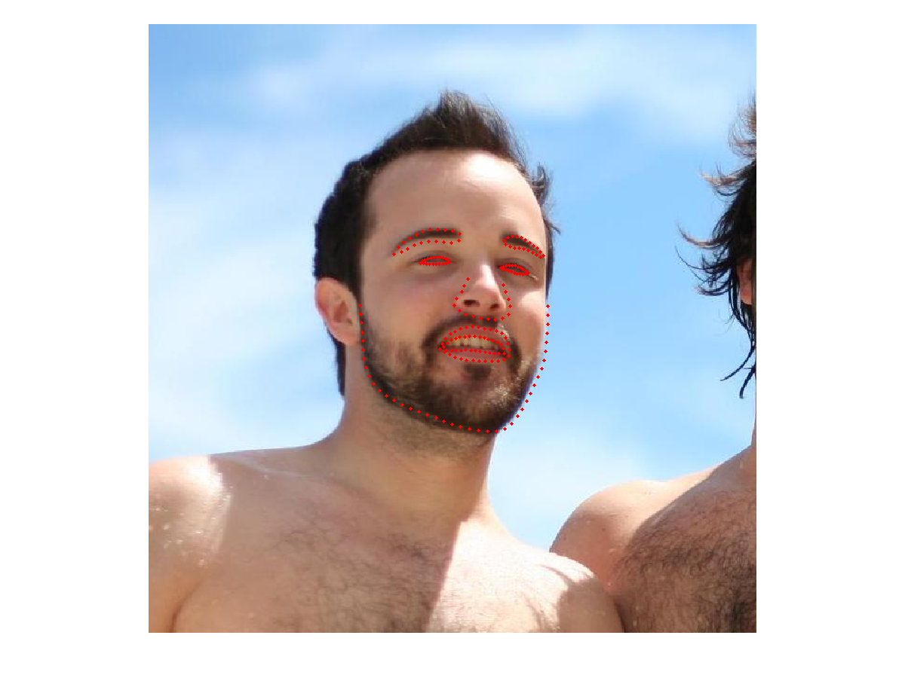
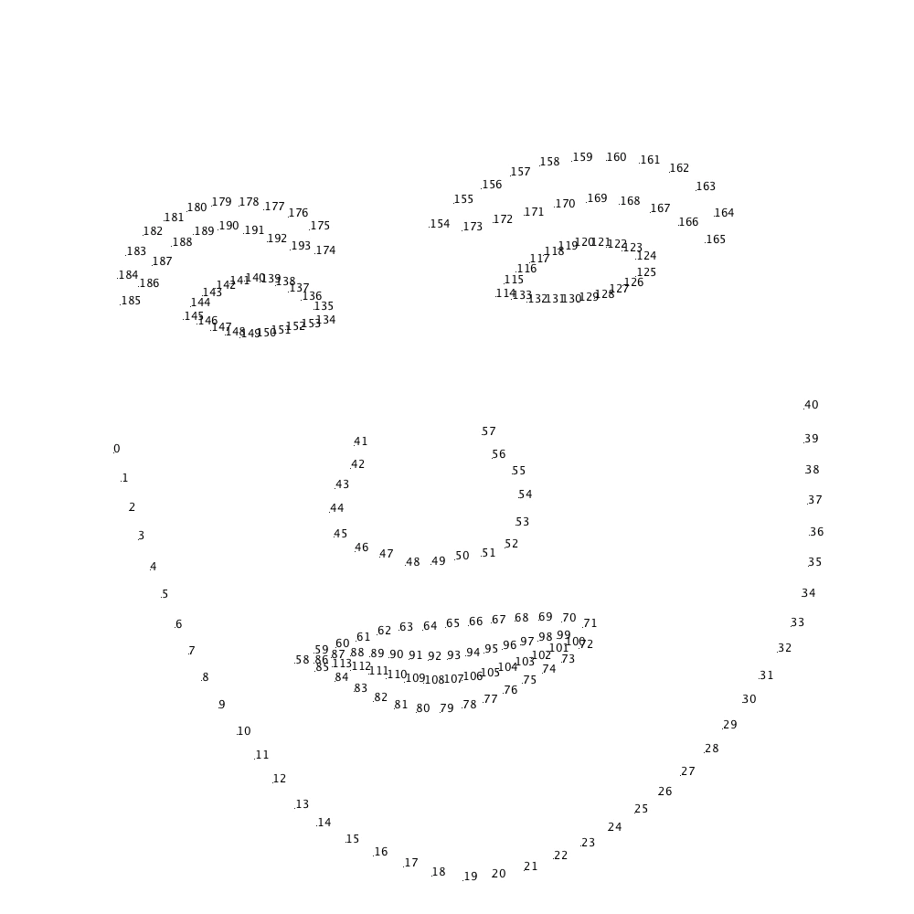

# PythohnでdlibとOpenCVを用いてHelen datasetを学習して顔器官研修

概要  
機械学習のライブラリであるdlibで顔器官（顔のパーツ検出）を行う。  
Helen datasetを用いれば194点で検出することができる。  

# Helen dataset
学習するデータセットは、[Helen dataset](http://www.ifp.illinois.edu/~vuongle2/helen/)を使用する。  
Helen datasetはイリノイ大学のVuong Leさんのサイトで公開されているデータセットです。




|n個目の座標|対応部分|
|---|---|
|0 - 40|顔の輪郭|
|41 - 57|鼻|
|58 - 85|口の外側|
|86 - 113|口の内側|
|114 - 133|右目|
|134 - 153|左目|
|154 - 173|右の眉毛|
|174 - 193|左の眉毛|


# 環境構築

ToDo 自分の環境を記述する

```
pip install opencv-python
pip install dlib
```

# 学習
[Helen dataset](http://www.ifp.illinois.edu/~vuongle2/helen/)のサイトへ行って、DownloadからTrain imagesをダウンロードします。  
Part1からPart5までダウンロードする。  

その後、座標データをダウンロードする。  
Downloadの中のc.Annotationと書いてあるところからAll facesをダウンロードする。  

更に、OpenCVの顔認識用のファイルもダウンロードする。
```
mkdir haarcascades
wget "https://raw.githubusercontent.com/opencv/opencv/master/data/haarcascades/haarcascade_frontalface_default.xml" -P haarcascades/
```

以下のようなディレクトリ構成にする。
```
- haarcascades/
    | - haarcascade_frontialface_default.xml
- learned-models/
    |  - helen-dataset-study.py
    |  - helen-dataset/
    |          | - annotations/
    |          |     | - 1.txt
    |          |     | - 2.txt
    |          |     |    ︙(annotationファイルたちを全部ぶちこむ)
    |          |
    |          | - 232194_1.jpg
    |          | - 1629243_1.jpg
    |          |      ︙(画像たちを全部ぶちこむ)
- find.py
```

learnded-models/helen-dataset-study.py
```Python
import dlib
import os
import sys
import multiprocessing
import cv2
import glob

NOW_ABS_FILEPATH = os.path.dirname(os.path.abspath(__file__))
HELEN_IMGS_ABS_FILEPATH = NOW_ABS_FILEPATH + '/helen-dataset/'
HELEN_ANNOTATIONS_ABS_FILEPATH = HELEN_IMGS_ABS_FILEPATH + 'annotations/'
CASCADE_PATH = os.path.dirname(os.path.abspath(__file__)) + "/../haarcascades/"

face_cascade = cv2.CascadeClassifier(
    CASCADE_PATH + 'haarcascade_frontalface_default.xml')
helen_annotations_filelist = glob.glob(HELEN_ANNOTATIONS_ABS_FILEPATH + '*')

xml_template_header = """<?xml version='1.0' encoding='ISO-8859-1'?>
<?xml-stylesheet type='text/xsl' href='image_metadata_stylesheet.xsl'?>
<dataset>
<name>helen dataset</name>
<comment>Created by kekeho.</comment>
<images>
"""

xml_template_footer = """</images>
</dataset>
"""

def generate_xml():
    xml = xml_template_header

    count = 0
    for file_name in helen_annotations_filelist:
        with open(file_name, 'r') as file:
            # count += 1
            # if count == 10:
            #     break

            img_filename = HELEN_IMGS_ABS_FILEPATH + file.readline().replace('\n', '') + \
                '.jpg'  # header is imgfile name

            image_xml = f"""
            <image file='{img_filename}'>
            """

            gray_image = cv2.imread(img_filename, cv2.IMREAD_GRAYSCALE)

            x, y, w, h = [int for i in range(4)]

            if len(face_position(gray_image)) != 1:
                print(
                    f"Image includes more than one face: ignore {img_filename}")
            else:
                x, y, w, h = face_position(gray_image)[0]

                image_xml += f"<box top='{y-50}' left='{x-50}' width='{w+100}' height='{h+100}'>\n"

                i = 0
                for line in file:
                    x, y = line.replace('\n', '').replace(
                        '\r', '').replace(' ', '').split(',')
                    image_xml += f"<part name='{i}' y='{y.split('.')[0]}' x='{x.split('.')[0]}' />\n"
                    i += 1
                image_xml += '</box>\n'
                image_xml += '</image>\n'

                xml += image_xml

    xml += xml_template_footer
    return xml


def face_position(gray_img):
    """Detect faces position
    Return:
        faces: faces position list (x, y, w, h)
    """
    faces = face_cascade.detectMultiScale(gray_img, minSize=(
        int(len(gray_img[0]) / 6), int(len(gray_img) / 6)))
    return faces


def main():

    # generate xml file
    with open('helen-dataset.xml', 'w') as out_xml_file:
        xml = generate_xml()
        out_xml_file.write(xml)

    # set options
    options = dlib.shape_predictor_training_options()
    options.num_threads = multiprocessing.cpu_count()  # cpu threads
    options.be_verbose = True

    train_xml_filename = './helen-dataset.xml'

    print("Start training")
    dlib.train_shape_predictor(
        train_xml_filename, "helen-dataset.dat", options)
    print("Finish")


if __name__ == '__main__':
    main()

```

上記プログラムを実行することで、learned-models/のはいかにhelen-dataset.datが生成される。  
これが学習済みファイルになる。  

# 認識

find.py
```Python
import cv2
import dlib
import numpy
import os

# Cascade files directory path
CASCADE_PATH = os.path.dirname(os.path.abspath(__file__)) + "/haarcascades/"
LEARNED_MODEL_PATH = os.path.dirname(
    os.path.abspath(__file__)) + "/learned-models/"
predictor = dlib.shape_predictor(
    LEARNED_MODEL_PATH + 'helen-dataset.dat')
face_cascade = cv2.CascadeClassifier(
    CASCADE_PATH + 'haarcascade_frontalface_default.xml')


def face_position(gray_img):
    """Detect faces position
    Return:
        faces: faces position list (x, y, w, h)
    """
    faces = face_cascade.detectMultiScale(gray_img, minSize=(100, 100))
    return faces


def facemark(gray_img):
    """Recoginize face landmark position by i-bug 300-w dataset
    Return:
        randmarks = [
        [x, y],
        [x, y],
        ...
        ]
        [0~40]: chin
        [41~57]: nose
        [58~85]: outside of lips
        [86-113]: inside of lips
        [114-133]: right eye
        [134-153]: left eye
        [154-173]: right eyebrows
        [174-193]: left eyebrows
    """
    faces_roi = face_position(gray_img)
    landmarks = []

    for face in faces_roi:
        x, y, w, h = face
        face_img = gray_img[y: y + h, x: x + w];

        detector = dlib.get_frontal_face_detector()
        rects = detector(gray_img, 1)

        landmarks = []
        for rect in rects:
            landmarks.append(
                numpy.array(
                    [[p.x, p.y] for p in predictor(gray_img, rect).parts()])
            )
    return landmarks


if __name__ == '__main__':
    cap = cv2.VideoCapture(0)
    while cap.isOpened():
        ret, frame = cap.read()
        gray = cv2.cvtColor(frame, cv2.COLOR_BGR2GRAY)

        landmarks = facemark(gray)

        for landmark in landmarks:
            for points in landmark:
                cv2.drawMarker(frame, (points[0], points[1]), (21, 255, 12))
        cv2.imshow("video frame", frame)
        if cv2.waitKey(25) & 0xFF == ord('q'):
            break

    cap.release()
    cv2.destroyAllWindows()
```